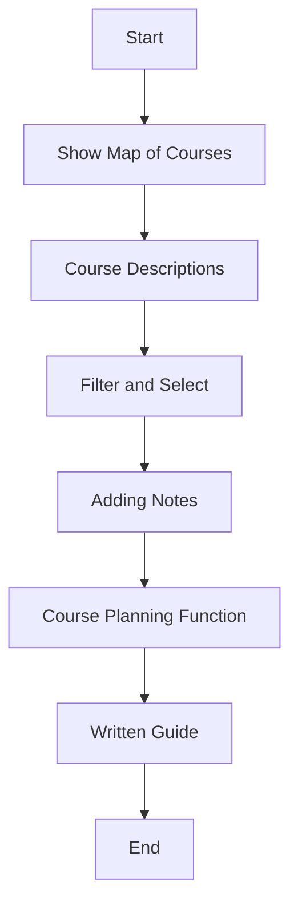
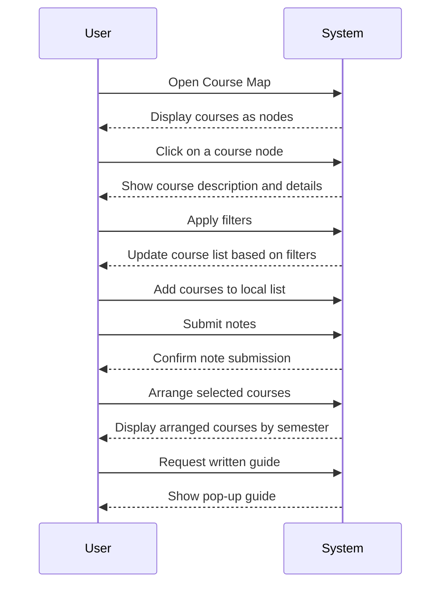

<!-- # Application Features Diagram

## Show map of courses

- Displays all applicable courses as connected nodes.

## Course Descriptions

- Clicking on a course node opens a window with:
  - Course description (SPIRE)
  - Dependencies
  - Possible bypasses
  - Special Info (Spring/Fall Only, Required for All, etc.)
  - Professor/Instructor Info
  - (Optional) Track affiliation (General Requirement, Robotics, etc.)

## Filter and Select

- Features:
  - Toggle filter for specific criteria
  - Local list for adding courses
  - "Show only selected courses" toggle
  - (Optional) Filter by tracks

## Adding Notes

- Users can submit notes under course descriptions for additional insights.

## Course Planning Function

- Selected courses can be arranged in a separate view as visual horizontal layers (semesters).

## (Optional) Written Guide

- Pop-up at the start to guide freshmen on course selection considerations. -->

