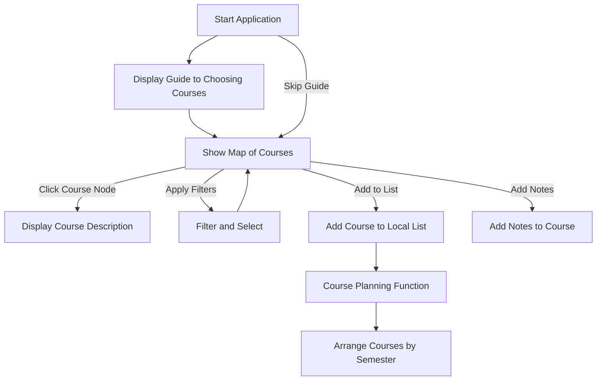

# Application Features

## Show map of courses

The **Show Map of Courses** feature visually displays all applicable courses on a 2D canvas as connected nodes. This show a way for users to explore the available courses and how they are related to one another.

Users can interact with the map by:

- Clicking on any course node to view more detailed information.
- Applying filters to narrow down the selection of courses.

This way simplifies course selection for users.

## Course Descriptions

Clicking on a course node will open a window that shows all key details about the course, such as:

- Course description as stated on SPIRE.
- Prerequisites and dependencies for enrolling in the course.
- Any bypass options available.
- Additional information such as whether the course is only offered in Spring/Fall or required for certain tracks.
- Professor or instructor information for the course.
- (Optional) The track the course belongs to, such as Gened Requirement, Robotics, Software Engineering, or Networks.

## Filter and Select

This feature allows users to apply filters to the course map for a more focused search using filters like:

- Degree tracks.
- Only displaying courses that meet certain prerequisites.
- Highlighting required courses for specific programs.

Users can also toggle between viewing all courses and only the ones they’ve selected. Once a course is selected, it can be added to the user’s local list for planning.

## Adding Notes

Students can contribute their own notes to course descriptions, adding useful information for others such as:

- Personal experiences with bypasses or prerequisites.
- Suggestions for alternative pathways or strategies for completing the course.

## Course Planning Function

The **Course Planning Function** allows users to take their selected courses and organize them into visual horizontal layers, with each layer representing a semester. This provides a clear and interactive way for students to plan their academic journey, ensuring that they meet the necessary prerequisites while spreading out their workload across semesters.

<!-- ## (Optional) Written Guide to Choosing Courses

For new users, particularly freshmen, an optional written guide will pop up at the start of the application. This guide will provide helpful advice on how to choose courses, what to consider in terms of prerequisites, and other important factors.

This feature is designed to ensure that even those unfamiliar with course selection can make informed decisions from the start. -->
