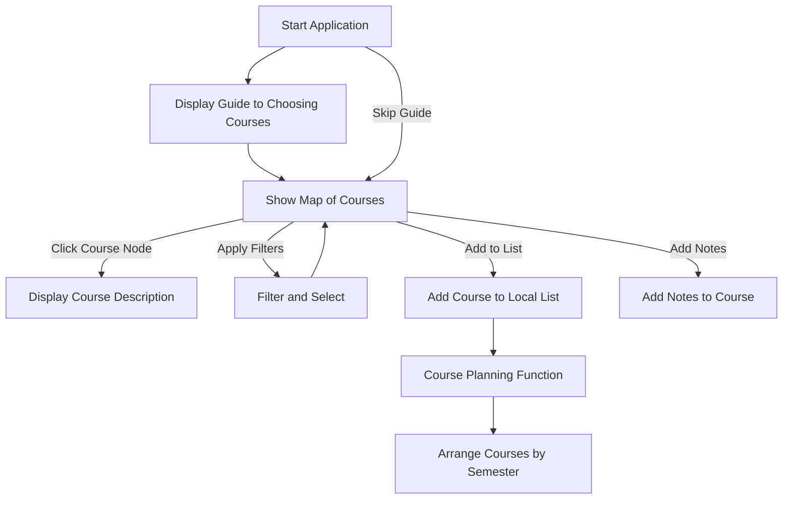

```mermaid
graph TD
    Start[Start Application]
    Start --> Guide[Display Guide to Choosing Courses]
    Guide --> Map[Show Map of Courses]
    Map -->|Click Course Node| Description[Display Course Description]
    Map -->|Apply Filters| Filter[Filter and Select]
    Filter --> Map
    Map -->|Add to List| Selection[Add Course to Local List]
    Selection --> Plan[Course Planning Function]
    Plan --> SemesterView[Arrange Courses by Semester]
    Map -->|Add Notes| Notes[Add Notes to Course]
    Start -->|Skip Guide| Map
```
